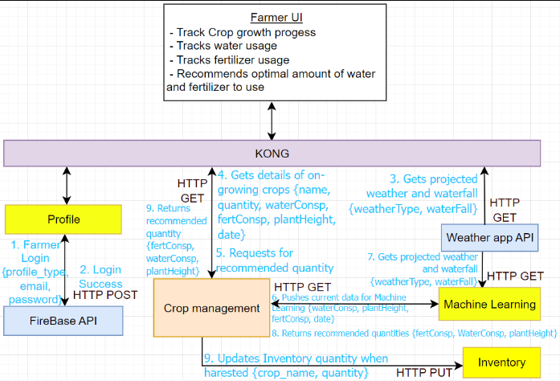

<!-- PROJECT LOGO -->
<br />
<div align="center">
  

  <p align="center">
    This outlines the project codebase for AY2022/2023 Semester 2 IS213 ESD - G1T1 
  </p>
</div>

<!-- TABLE OF CONTENTS -->
<details>
  <summary>Table of Contents</summary>
  <ol>
    <li>
      <a href="#about-the-project">About The Project</a>
      <ul>
        <li><a href="#technical-diagrams">Technical Diagrams</a></li>
      </ul>
    </li>
    <li>
      <a href="#built-with">Built With</a>
      <ul>
        <li><a href="#frontend">Frontend</a></li>
        <li><a href="#api-gateway">API Gateway</a></li>
	<li><a href="#backend">Backend</a></li>
        <li><a href="#message-brokers">Message Brokers</a></li>
	<li><a href="#devops">DevOps</a></li>
        <li><a href="#deployment">Deployment</a></li>
	<li><a href="#external-apis-used">External APIs used</a></li>
      </ul>
    </li>
    <li>
      <a href="#getting-started">Getting Started</a>
      <ul>
        <li><a href="#configuring-backend">Configuring Backend</a></li>
	<li><a href="#prerequisites">Prerequisites</a></li>
      </ul>
    </li>
    <li><a href="#usage">Usage</a></li>
    <li>
      <a href="#scenario-1">Scenario 1</a>
      <ul>
        <li><a href="#additional-points">Additional Points</a></li>
      </ul>
    </li>
    <li><a href="#scenario-2">Scenario 2</a></li>
    <li>
      <a href="#scneario-3">Scenario 3</a>
      <ul>
        <li><a href="#additional-points">Additional Points</a></li>
      </ul>
    </li>
    <li><a href="#container-orchestration">Container Orchestration</a></li>
    <li><a href="#kubernetes-deployment">Kubernetes Deployment</a></li>
    <li><a href="#acknowledgments">Acknowledgments</a></li>
  </ol>
</details>

<!-- ABOUT THE PROJECT -->

## About The Project

FreshGo aims to give farmers more control over their products, both in terms of sale as well as growth of their crops. This ultimately reduces costs for both customers and consumers by cutting out the middle-man and provides more job opportunities for would-be delivery staff.

### Technical Diagrams

<div align="center">
	
	
</div>

<p align="right">(<a href="#top">back to top</a>)</p>

## Built With

### Frontend

- [Vue.js](https://vuejs.org/)

### API Gateway

- [KONG](https://konghq.com)

### Backend

- [Python](https://python.org/)
- [Node.js](https://nodejs.org/)
- [Java Spring Boot](https://spring.io/)

### Message Brokers

- [RabbitMQ](https://rabbitmq.com)
- [Apache Kafka](https://kafka.apache.com)

### DevOps

- [Docker](https://docker.com)

### Deployment

- [Tanzu Community Edition](https://tanzucommunityedition.io/)

### External APIs used

- [Weather API](https://openweathermap.org/current)
- [Google Maps API](https://www.npmjs.com/package/vue2-google-maps)
- [Twilio API](https://www.twilio.com/docs/sms/api/message-resource)
- [Stripe API](https://stripe.com/docs/api/payment_intents)
- [Firebase API](https://firebase.google.com/docs/reference)
<p align="right">(<a href="#top">back to top</a>)</p>

<!-- GETTING STARTED -->

## Getting Started

### Configuring Backend

Make sure you have a clean environment with no other containers as it can possibly conflict with this project’s ports mapping, image or container naming/labeling. Make sure that the Kong container and image is also deleted along with its network to set up a new kong configuration.

1. From the directory ./ESD-G1T1, open the terminal and enter `docker compose up`
2. Access [http://localhost:1337](http://localhost:1337) in a browser to create an admin user for Konga

```
Username: admin
Email:    <your email address>
Password: adminadmin
```

3. Sign in to continue
4. Connect Konga to Kong by creating a new connection

```
Name: default
Kong Admin URL: http://kong:8001
```

5. Go to Snapshots located on bottom right of the sidebar
6. Select IMPORT FROM FILE and import ./tools/kongSnapshot.json
7. Click on DETAILS for the new snapshot created
8. Select RESTORE, tick all of the boxes, and click on IMPORT OBJECTS

<p align="right">(<a href="#top">back to top</a>)</p>

### Prerequisites

- Docker - 23.10.2
- Node - 16.13.0

Ensure you are running the same version by running the packages with `--version` in the terminal

<p align="right">(<a href="#top">back to top</a>)</p>

<!-- USAGE EXAMPLES -->

## Usage

1. Open folder in vscode and open terminal
2. Install required dependencies

```sh
	$ cd client
	$ npm install
```

3. Launch FreshGo Application

```sh
	$ npm run serve
```

4. Platform is only compatible for browser

<p align="right">(<a href="#top">back to top</a>)</p>

## Scenario 1

Customer makes purchase from Farmer via our app

<div align="center">
	
</div>
<div align="center">
	
</div>

### Additional Points

1.Firebase is used as our API gateway for security implementations. Kong keeps the internal microservices frmo being directly exposed to external clients. 

2. To handle exceptions in business logic, Error handling is implemented if username or password is incorrect when logging in. User will be notified of the incorrect username or password

<p align="right">(<a href="#top">back to top</a>)</p>

## Scenario 2

Farmers receive low-supply crop updates on demand to maintain adequate inventory

<div align="center">
	
</div>
<div align="center">
	
</div>

<p align="right">(<a href="#top">back to top</a>)</p>

## Scenario 3

Farmers track crop growth

<div align="center">
	
</div>
<div align="center">
	
</div>
	
### Additional Points
1. Used machine learning microservice to hit beyond the labs

<p align="right">(<a href="#top">back to top</a>)</p>

## Container Orchestration

- The services enclosed within the red box represent a collection of Docker Swarm pods that contain our services.
- Our Kong gateway serves as a bridge between the clients and the pods. By leveraging Docker Swarm, we can readily scale our services.
- Docker Swarm facilitates seamless scaling of services through either vertical or horizontal Pod Autoscaler, along with their automated load-balancer.

<div align="center">
	
</div>

<p align="right">(<a href="#top">back to top</a>)</p>


<!-- ACKNOWLEDGMENTS -->

## Acknowledgments

* [Calista Lee Yen Ling](https://github.com/cal-lee)
* [Eng T-Leng](https://github.com/T-Leng)
* [Tan Yi Peng](https://github.com/tanyipeng834)
* [Tim Mo Seng](https://github.com/MoSengT)
* [Wu Hao](https://github.com/wuhao212)
* [Yong Lip Khim](https://github.com/JermYong)

<p align="right">(<a href="#top">back to top</a>)</p>
