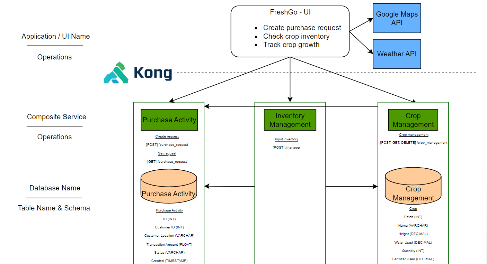
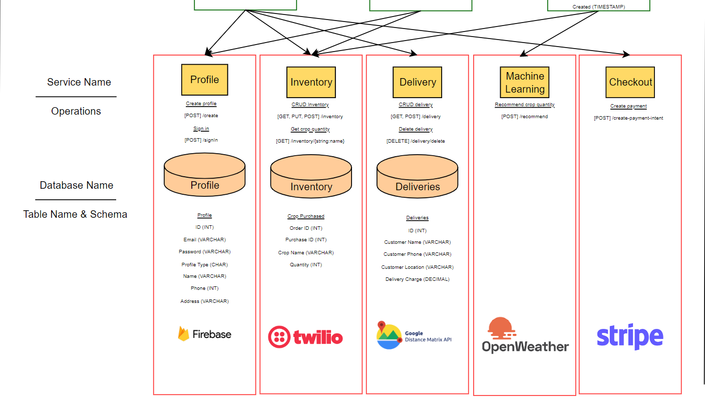

<!-- PROJECT LOGO -->
<br />
<div align="center">
  

  <p align="center">
    This outlines the project codebase for AY2022/2023 Semester 2 IS213 ESD - G1T1 
  </p>
</div>

<!-- TABLE OF CONTENTS -->
<details>
  <summary>Table of Contents</summary>
  <ol>
    <li>
      <a href="#about-the-project">About The Project</a>
      <ul>
        <li><a href="#technical-diagrams">Technical Diagrams</a></li>
      </ul>
    </li>
    <li>
      <a href="#built-with">Built With</a>
      <ul>
        <li><a href="#frontend">Frontend</a></li>
        <li><a href="#api-gateway">API Gateway</a></li>
	<li><a href="#backend">Backend</a></li>
        <li><a href="#message-brokers">Message Brokers</a></li>
	<li><a href="#devops">DevOps</a></li>
	<li><a href="#external-apis-used">External APIs used</a></li>
      </ul>
    </li>
    <li>
      <a href="#getting-started">Getting Started</a>
      <ul>
        <li><a href="#configuring-backend">Configuring Backend</a></li>
	<li><a href="#prerequisites">Prerequisites</a></li>
      </ul>
    </li>
    <li><a href="#usage">Usage</a></li>
    <li>
      <a href="#scenario-1">Scenario 1</a>
      <ul>
        <li><a href="#additional-points">Additional Points</a></li>
      </ul>
    </li>
    <li><a href="#scenario-2">Scenario 2</a></li>
    <li>
      <a href="#scneario-3">Scenario 3</a>
      <ul>
        <li><a href="#additional-points">Additional Points</a></li>
      </ul>
    </li>
    <li><a href="#container-orchestration">Container Orchestration</a></li>
    <li><a href="#acknowledgments">Acknowledgments</a></li>
  </ol>
</details>

<!-- ABOUT THE PROJECT -->

## About The Project

FreshGo aims to give farmers more control over their products, both in terms of sale as well as growth of their crops. This ultimately reduces costs for both customers and consumers by cutting out the middle-man and provides more job opportunities for would-be delivery staff.

### Technical Diagrams

<div align="center">
	<br>
	<br>
	
	<br>
	<br>
  
</div>

<p align="right">(<a href="#top">back to top</a>)</p>

## Built With

### Frontend

- [Vue.js](https://vuejs.org/)

### API Gateway

- [KONG](https://konghq.com)

### Backend

- [Python](https://python.org/)
- [Node.js](https://nodejs.org/)
- [Express JS](https://expressjs.com/)
- [GraphQL](https://graphql.org/)

### Message Brokers

- [RabbitMQ](https://rabbitmq.com)

### DevOps

- [Docker](https://docker.com)

### External APIs used

- [Weather API](https://openweathermap.org/current)
- [Google Maps API](https://www.npmjs.com/package/vue2-google-maps)
- [Twilio API](https://www.twilio.com/docs/sms/api/message-resource)
- [Stripe API](https://stripe.com/docs/api/payment_intents)
- [Google Distance API](https://developers.google.com/maps/documentation/distance-matrix/overview)
- [Firebase API](https://firebase.google.com/docs/reference)
<p align="right">(<a href="#top">back to top</a>)</p>

<!-- GETTING STARTED -->

## Getting Started

### Configuring Backend

Make sure you have a clean environment with no other containers as it can possibly conflict with this project’s ports mapping, image or container naming/labeling. Make sure that the Kong container and image is also deleted along with its network to set up a new kong configuration.

1. From the directory ./ESD-G1T1, open the terminal and enter `docker compose up`
2. Access [http://localhost:1337](http://localhost:1337) in a browser to create an admin user for Konga

```
Username: admin
Email:    <your email address>
Password: adminadmin
```

3. Sign in to continue
4. Connect Konga to Kong by creating a new connection

```
Name: default
Kong Admin URL: http://kong:8001
```

5. Go to Snapshots located on bottom right of the sidebar
6. Select IMPORT FROM FILE and import ./kong.json
7. Click on DETAILS for the new snapshot created
8. Select RESTORE, tick all of the boxes, and click on IMPORT OBJECTS
### Configuring DataBases

1. Start Wamp Server and Log In to PhpMyAdmin
2. Import all the SQL files from the database Folder into WAMP Server

<p align="right">(<a href="#top">back to top</a>)</p>

### Prerequisites

- Docker - 23.10.2
- Node - 16.13.0

Ensure you are running the same version by running the packages with `--version` in the terminal

<p align="right">(<a href="#top">back to top</a>)</p>

<!-- USAGE EXAMPLES -->

## Usage

1. Open folder in vscode and open terminal
2. Install required dependencies

```sh
	$ cd client
	$ npm install
```

3. Launch FreshGo Frontend

```sh
	$ npm run serve
```

4. Launch FreshGo Microservices

```sh
	$ docker-compose up
```

<p align="right">(<a href="#top">back to top</a>)</p>

## Scenario 1

Customer makes purchase from Farmer via our app

<div align="center">
	
</div>
<div align="center">
	<details>
	  <summary>Expand for Screenshots of Scenario 1</summary>
	  
	  
	  
	  
	</details>
</div>

### Additional Points

1.Firebase is used in conjunction with Profile Microservice. This helps to authenticate the email before it is stored in the Profile Microservice.

2.Stripe API is used to process payment, payment is calculated through the use of Google Distance Matrix Api.

3. There is also a use of AMQP Message broker which helps to asynchronously request and reply between the Purchase Activity Microservice and the Delivery Microservice.

4. We also use embed the Google Maps in the UI which allows the customer to track the live location of the Delivery Rider .

<p align="right">(<a href="#top">back to top</a>)</p>

## Scenario 2

Farmers receive low-supply crop updates on demand to maintain adequate inventory

<div align="center">
	
</div>


<div align="center">
	<details>
	  <summary>Expand for Screenshots of Scenario 2</summary>
	  
	  
	  
	  
	</details>
</div>

### Additional Points

1. Twilio api is used to give farmers notification through their mobile numbers when their inventory reach critical level.

2. Weather api for farmers to get essential information about the forecasted weather conditions.

3. Farmer can use our UI to predict how much he has to plant to meet their demand based on past Purchases, On-Growing Crops and the current number of Crops in the inventory.

4. Inventory Manager Microservice utilizes Express Js which invokes graphQL. This is to highlight that microservice are language agnostic and can use different communication protocols other than REST.


## Scenario 3

Farmers track crop growth

<div align="center">
	
</div>


<div align="center">
	<details>
		<summary>Expand for Screenshots of Scenario 3</summary>
		
		
		
		
		
		
		
	</details>
</div>
	
### Additional Points
1. Used Multivariate Regression Machine Learning Model to recommend the optimal amount of fertilizer and water to use to achieve optimal Crop Growth.


<p align="right">(<a href="#top">back to top</a>)</p>

<!-- Beyond the Labs -->

## Beyond the Labs

* External API
  - Firebase Authentication API
  - Stripe Payment API
  - Google Maps API
  - Google Distance Matrix API
  - Data.Gov Weather API
  - Twilio Messaging API

* API Gateway
  - Kong

* Microservice
  - Express JS - Inventory Management MS
  - GraphQL - Inventory Management MS

<p align="right">(<a href="#top">back to top</a>)</p>

<!-- ACKNOWLEDGMENTS -->

## Acknowledgments

* [Calista Lee Yen Ling](https://github.com/cal-lee)
* [Eng T-Leng](https://github.com/T-Leng)
* [Tan Yi Peng](https://github.com/tanyipeng834)
* [Tim Mo Seng](https://github.com/MoSengT)
* [Wu Hao](https://github.com/wuhao212)
* [Yong Lip Khim](https://github.com/JermYong)

<p align="right">(<a href="#top">back to top</a>)</p>
